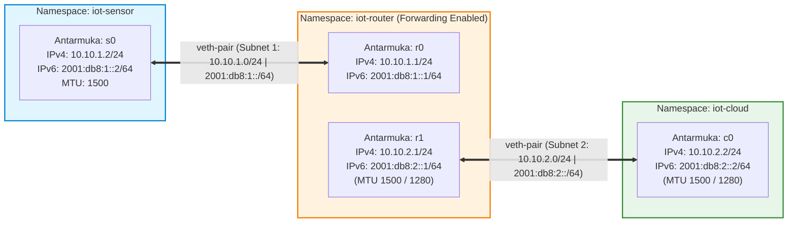

# 🌐 IoT Internet Layer Laboratory: Dual-Stack IPv4/IPv6 Simulation

[](https://ubuntu.com/)
[](https://en.wikipedia.org/wiki/IPv6)
[](https://man7.org/linux/man-pages/man8/ip-netns.8.html)
[](https://www.python.org/)
[](https://github.com/)
[](LICENSE)
[](https://ugm.ac.id/)

Repositori ini memuat implementasi laboratorium eksperimental simulasi **Lapisan Internet (Internet / Network Layer)** dalam arsitektur Internet of Things (IoT). Simulasi ini dirancang menggunakan **Linux Network Namespaces (`ip-netns`)** dan pasangan antarmuka virtual (*veth pair*) pada satu mesin virtual (VM) Ubuntu terisolasi tanpa memerlukan perangkat keras mikrokontroler atau radio fisik.

---

## 📑 Daftar Isi
- [Ringkasan Proyek](#-ringkasan-proyek)
- [Topologi & Alokasi Jaringan](#-topologi--alokasi-jaringan)
- [Struktur Direktori Repository](#-struktur-direktori-repository)
- [Panduan Penggunaan Cepat (Quick Start)](#-panduan-penggunaan-cepat-quick-start)
- [Rincian 5 Eksperimen Laboratorium](#-rincian-5-eksperimen-laboratorium)
  - [Eksperimen 1: Pembangunan & Inspeksi Topologi](#eksperimen-1-pembangunan--inspeksi-topologi)
  - [Eksperimen 2: Resolusi Alamat Link-Layer (ARP vs ICMPv6 NDP)](#eksperimen-2-resolusi-alamat-link-layer-arp-vs-icmpv6-ndp)
  - [Eksperimen 3: Routing, Forwarding, & Diagnosis Kegagalan](#eksperimen-3-routing-forwarding--diagnosis-kegagalan)
  - [Eksperimen 4: Path MTU Discovery (PMTU) & ICMPv6 Packet Too Big](#eksperimen-4-path-mtu-discovery-pmtu--icmpv6-packet-too-big)
  - [Eksperimen 5: Komunikasi Layanan HTTP di Atas IPv6](#eksperimen-5-komunikasi-layanan-http-di-atas-ipv6)
- [Tabulasi Hasil Pengujian Skenario Jaringan](#-tabulasi-hasil-pengujian-skenario-jaringan)
- [Konsep Kunci & Jawaban Analisis](#-konsep-kunci--jawaban-analisis)
- [Troubleshooting & Solusi](#-troubleshooting--solusi)
- [Dokumen & Laporan](#-dokumen--laporan)
- [Tim Penyusun & Lisensi](#-tim-penyusun--lisensi)

---

## 🎯 Ringkasan Proyek

Eksperimen ini mengeksplorasi secara empiris protokol dan karakteristik operasional lapisan internet pada stack TCP/IP, meliputi:
1. **Isolasi Lingkungan Jaringan:** Pembentukan 3 domain jaringan independen (`iot-sensor`, `iot-router`, `iot-cloud`) menggunakan *Linux Network Namespaces*.
2. **Dual-Stack Addressing & Routing:** Penyetelan alamat IPv4 statis (`/24`) dan IPv6 statis (`/64`), forwarding kernel, dan tabel rute dua arah.
3. **Resolusi Alamat Link-Layer L2:** Mengamati perbedaan fundamental mekanisme broadcast pada **ARP (IPv4)** versus multicast hemat energi pada **Neighbor Discovery Protocol / NDP (IPv6)**.
4. **Diagnosis Kegagalan Transmisi:** Menganalisis dampak habisnya *Hop Limit* (*Time to Live / TTL* = 1), hilangnya rute balik (*missing return route*), dan penonaktifan *packet forwarding*.
5. **Constrained Path MTU Discovery (PMTU):** Mengamati respons kendala bandwidth kecil ketika router mengirim sinyal umpan balik **ICMPv6 Type 2 Code 0 (*Packet Too Big*)** saat MTU tautan dibatasi ke batas minimum standar IPv6 (1280 byte).
6. **Layanan Aplikasi IPv6:** Pengujian transmisi aplikasi end-to-end menggunakan klien socket raw TCP Python menuju server web IPv6.

---

## 📐 Topologi & Alokasi Jaringan

### Diagram Arsitektur Jaringan (Mermaid)



### Tabel Alokasi Alamat IP & Antarmuka

| Namespace | Antarmuka Virtual | Subnet | Alamat IPv4 | Alamat IPv6 (`/64`) | Peran / Fungsi |
|---|---|---|---|---|---|
| **`iot-sensor`** | `s0` | Subnet 1 | `10.10.1.2/24` | `2001:db8:1::2/64` | Node Sensor (Pengirim data / IoT Edge) |
| **`iot-router`** | `r0` | Subnet 1 | `10.10.1.1/24` | `2001:db8:1::1/64` | Gateway sisi sensor |
| **`iot-router`** | `r1` | Subnet 2 | `10.10.2.1/24` | `2001:db8:2::1/64` | Gateway sisi cloud collector |
| **`iot-cloud`** | `c0` | Subnet 2 | `10.10.2.2/24` | `2001:db8:2::2/64` | Cloud Collector (Penerima data & Server) |

---

## 📁 Struktur Direktori Repository

```text
iot-internet-layer-lab/
├── .github/
│   └── workflows/
│       └── ci.yml                     # Otomasi pengujian sintaksis Python & ShellCheck
├── docs/                              # Dokumen resmi dan analisis teoretis
│   ├── laporan-internet-layer.docx    # Laporan resmi lengkap praktikum (Word)
│   ├── Tutorial_Internet_Layer.pdf    # Buku panduan modul laboratorium
│   └── evaluasi_dan_analisis.md       # Analisis terperinci & jawaban pertanyaan evaluasi
├── scripts/                           # Kumpulan skrip otomasi eksekusi laboratorium
│   ├── network_lab.sh                 # Pembangun dan pembersih topologi (up, down, status)
│   ├── verify_connectivity.sh         # Skrip pengujian otomatisasi konektivitas (self-test)
│   ├── ipv6_http_client.py            # Klien HTTP soket mentah TCP IPv6
│   └── ipv6_http_server.py            # Server HTTP mandiri IPv6 untuk cloud collector
├── .gitignore                         # Mengabaikan file sampah Office, OS, dan cache
├── LICENSE                            # Lisensi sumber terbuka (MIT License)
├── Makefile                           # Pintasan praktis perintah terminal Linux
└── README.md                          # Dokumentasi utama proyek
```

---

## 🚀 Panduan Penggunaan Cepat (Quick Start)

### Prasyarat Sistem
- **Sistem Operasi:** Linux Ubuntu (direkomendasikan versi 22.04 LTS atau 24.04 LTS).
- **Hak Akses:** Hak akses administrator (`sudo` / `root`).
- **Paket yang Dibutuhkan:**
  ```bash
  sudo apt-get update
  sudo apt-get install -y iproute2 iputils-ping tcpdump python3
  ```

### 1. Membangun Topologi Jaringan
Jalankan skrip pembangun topologi menggunakan `make` atau perintah `bash` langsung:
```bash
# Menggunakan Makefile:
make up

# Atau perintah langsung:
sudo bash scripts/network_lab.sh up
```
**Output Terminal:**
```text
[*] Initializing network namespaces...
[OK] READY: iot-sensor <-> iot-router <-> iot-cloud
Run 'sudo bash scripts/network_lab.sh status' to inspect configured IP addresses and routes.
```

### 2. Memeriksa Status Konfigurasi
```bash
make status
# Atau: sudo bash scripts/network_lab.sh status
```

### 3. Menjalankan Pengujian Otomatis (*Self-Test*)
Skrip `verify_connectivity.sh` akan memverifikasi keberadaan namespace, flag forwarding kernel, ping IPv4/IPv6 end-to-end, dan resolusi rute next-hop:
```bash
make test
# Atau: sudo bash scripts/verify_connectivity.sh
```

### 4. Membersihkan Laboratorium
Setelah selesai melakukan pengujian, hapus seluruh namespace secara bersih:
```bash
make down
# Atau: sudo bash scripts/network_lab.sh down
```

---

## 🔬 Rincian 5 Eksperimen Laboratorium

### Eksperimen 1: Pembangunan & Inspeksi Topologi
Pada eksperimen pertama, topologi 3 namespace dibuat dan dikonfigurasi. Antarmuka veth dihubungkan berpasangan menyerupai kabel jaringan fisik.

1. **Inspeksi Alamat IP Antarmuka:**
   ```bash
   sudo ip -n iot-sensor -br addr
   sudo ip -n iot-router -br addr
   sudo ip -n iot-cloud -br addr
   ```
   *Output (`iot-sensor`):*
   ```text
   lo               UP             127.0.0.1/8 ::1/128
   s0@if2           UP             10.10.1.2/24 2001:db8:1::2/64 fe80::b81f:17ff:fe00:fdff/64
   ```

2. **Pengujian Konektivitas Dasar (Sensor $\to$ Cloud):**
   ```bash
   # Uji IPv4 End-to-End
   sudo ip netns exec iot-sensor ping -c 2 10.10.2.2
   
   # Uji IPv6 End-to-End
   sudo ip netns exec iot-sensor ping -6 -c 2 2001:db8:2::2
   ```
   *Output Ping IPv4:*
   ```text
   PING 10.10.2.2 (10.10.2.2) 56(84) bytes of data.
   64 bytes from 10.10.2.2: icmp_seq=1 ttl=63 time=0.082 ms
   64 bytes from 10.10.2.2: icmp_seq=2 ttl=63 time=0.075 ms

   --- 10.10.2.2 ping statistics ---
   2 packets transmitted, 2 received, 0% packet loss, time 1018ms
   ```

---

### Eksperimen 2: Resolusi Alamat Link-Layer (ARP vs ICMPv6 NDP)
Eksperimen ini menganalisis bagaimana alamat Layer 3 (IP) dipetakan ke alamat fisik Layer 2 (MAC).

1. **Pemeriksaan Tabel ARP (IPv4):**
   ```bash
   sudo ip netns exec iot-sensor ip neigh show nud reachable
   ```
   *Output:*
   ```text
   10.10.1.1 dev s0 lladdr 72:3d:d4:1a:88:51 REACHABLE
   ```
   > **Analisis:** Sensor hanya menyimpan MAC address dari *gateway* (`10.10.1.1` / `r0`), bukan MAC tujuan akhir (`10.10.2.2`). Hal ini membuktikan bahwa protokol ARP bekerja dalam lingkup *link-local broadcast*.

2. **Pemeriksaan Tabel Neighbor Cache (IPv6 NDP):**
   ```bash
   sudo ip netns exec iot-sensor ip -6 neigh show nud reachable
   ```
   *Output:*
   ```text
   2001:db8:1::1 dev s0 lladdr 72:3d:d4:1a:88:51 router REACHABLE
   ```
   > **Analisis:** Pada IPv6, resolusi MAC dilakukan melalui **ICMPv6 Neighbor Solicitation (Type 135)** dan **Neighbor Advertisement (Type 136)** menggunakan multicast khusus (*Solicited-Node Multicast Address*), mengeliminasi broadcast yang memboroskan daya perangkat IoT.

---

### Eksperimen 3: Routing, Forwarding, & Diagnosis Kegagalan

#### A. Pembatasan Hop Limit / TTL (TTL = 1)
```bash
sudo ip netns exec iot-sensor ping -t 1 -c 2 10.10.2.2
```
*Output Terminal:*
```text
PING 10.10.2.2 (10.10.2.2) 56(84) bytes of data.
From 10.10.1.1 icmp_seq=1 Time to Live exceeded
From 10.10.1.1 icmp_seq=2 Time to Live exceeded

--- 10.10.2.2 ping statistics ---
2 packets transmitted, 0 received, +2 errors, 100% packet loss, time 1002ms
```
> **Penjelasan Teknis:** Router mendekremen nilai TTL/Hop Limit sebesar 1 saat meneruskan paket ($1 - 1 = 0$). Karena nilainya menjadi 0, paket dibuang dan router membalas dengan pesan *ICMP Time Exceeded* untuk mencegah paket berputar selamanya di internet.

#### B. Menghapus Rute Balik (*Missing Return Route*)
```bash
# Hapus rute balik pada sisi cloud
sudo ip -n iot-cloud route del 10.10.1.0/24

# Lakukan pengujian ping IPv4 dan IPv6
sudo ip netns exec iot-sensor ping -c 2 -W 1 10.10.2.2
sudo ip netns exec iot-sensor ping -6 -c 2 -W 1 2001:db8:2::2

# Kembalikan rute balik
sudo ip -n iot-cloud route add 10.10.1.0/24 via 10.10.2.1
```
*Output Terminal:*
- **IPv4:** `100% packet loss` (Cloud menerima request tetapi tidak tahu rute balik menuju `10.10.1.0/24`).
- **IPv6:** `0% packet loss` (Tetap berhasil karena rute IPv6 tidak dihapus).

---

### Eksperimen 4: Path MTU Discovery (PMTU) & ICMPv6 Packet Too Big

Pada jaringan IoT berdaya rendah, kapasitas transmisi fisik sangat terbatas. Standar RFC 8200 mewajibkan setiap tautan IPv6 memiliki MTU minimal **1280 byte**.

1. **Konfigurasi MTU Bottleneck (1280 Byte) pada Link Router-Cloud:**
   ```bash
   sudo ip -n iot-router link set r1 mtu 1280
   sudo ip -n iot-cloud link set c0 mtu 1280
   ```

2. **Kirim Paket Oversized (Payload 1400 Byte):**
   ```bash
   sudo ip netns exec iot-sensor ping -6 -M do -s 1400 -c 2 2001:db8:2::2
   ```
   *Output Terminal:*
   ```text
   PING 2001:db8:2::2 (2001:db8:2::2) 1400 data bytes
   From 2001:db8:1::1 icmp_seq=1 Packet too big: mtu=1280
   ping: sendmsg: Message too long

   --- 2001:db8:2::2 ping statistics ---
   2 packets transmitted, 0 received, +2 errors, 100% packet loss, time 1037ms
   ```
   > **Analisis:** Router menolak memfragmentasi paket IPv6 di tengah jalan. Router mengirimkan umpan balik **ICMPv6 Type 2 Code 0 (*Packet Too Big*)** dengan informasi nilai `MTU=1280` agar host pengirim memperkecil ukuran paketnya.

3. **Kirim Paket Sesuai Batas MTU (Payload 1232 Byte):**
   $$\text{Total Frame} = 1232\text{ (Payload)} + 40\text{ (Header IPv6)} + 8\text{ (Header ICMPv6)} = \mathbf{1280\text{ Byte}}$$
   ```bash
   sudo ip netns exec iot-sensor ping -6 -M do -s 1232 -c 2 2001:db8:2::2
   ```
   *Output Terminal:*
   ```text
   1240 bytes from 2001:db8:2::2: icmp_seq=1 ttl=63 time=0.089 ms
   1240 bytes from 2001:db8:2::2: icmp_seq=2 ttl=63 time=0.076 ms

   --- 2001:db8:2::2 ping statistics ---
   2 packets transmitted, 2 received, 0% packet loss, time 1024ms
   ```

---

### Eksperimen 5: Komunikasi Layanan HTTP di Atas IPv6

Eksperimen akhir membuktikan bahwa stack IPv6 dapat melayani komunikasi layer aplikasi (L7 HTTP) di atas socket TCP.

1. **Jalankan Server HTTP IPv6 di Namespace `iot-cloud`:**
   ```bash
   # Terminal 1:
   make server
   # Atau: sudo ip netns exec iot-cloud python3 scripts/ipv6_http_server.py
   ```
   *Log Server:*
   ```text
   [*] Starting IoT IPv6 Cloud Server
   [*] Listening Address : [2001:db8:2::2]:8000
   [*] Protocol          : IPv6 / TCP (HTTP/1.0)
   ```

2. **Jalankan Klien Soket TCP IPv6 di Namespace `iot-sensor`:**
   ```bash
   # Terminal 2:
   make client
   # Atau: sudo ip netns exec iot-sensor python3 scripts/ipv6_http_client.py
   ```
   *Log Klien Sensor:*
   ```text
   [*] Target Endpoint : http://[2001:db8:2::2]:8000/
   [*] Address Family  : AF_INET6 (IPv6)
   [*] Transport Proto : SOCK_STREAM (TCP)
   [*] Connecting to [2001:db8:2::2]:8000 ...
   [+] TCP 3-Way Handshake completed in 0.45 ms

   --- [Sent HTTP Request] ---
   > GET / HTTP/1.0
   > Host: [2001:db8:2::2]:8000
   > User-Agent: IoTSensor-IPv6Client/1.0

   --- [Received HTTP Response] ---
   HTTP/1.0 200 OK
   Server: IoTCloudCollector/1.0 (IPv6)
   Content-Type: text/html; charset=utf-8

   <!DOCTYPE html>
   <html>
   <head><title>IoT Cloud Collector (IPv6)</title></head>
   <body>
     <h1>🌐 IoT Cloud Collector Server</h1>
     <p>Status: Active & Listening on IPv6</p>
   </body>
   </html>
   --------------------------------
   [+] Total payload received : 287 bytes
   [+] Round-Trip Total Time  : 1.12 ms
   [+] Status                 : SUCCESS (200 OK)
   ```

---

## 📊 Tabulasi Hasil Pengujian Skenario Jaringan

| Skenario Pengujian | Target IP / Hop | Hasil | Bukti Paket / Respons | Diagnosa & Penjelasan |
|---|---|:---:|---|---|
| **Baseline IPv4 Ping** | `10.10.1.1` (`r0`) | **PASS** | ICMP Echo Reply | Routing statis 2 arah IPv4 berjalan normal |
| **Baseline IPv6 Ping** | `2001:db8:1::1` (`r0`) | **PASS** | ICMPv6 Echo Reply | Routing IPv6 `/64` dan NDP berfungsi normal |
| **Missing Return Route** | `10.10.1.1` (`r0`) | **FAIL** | 100% loss (no reply) | Cloud tidak memiliki rute kembali ke `10.10.1.0/24` |
| **Disabled Forwarding** | Dropped at `r0` | **FAIL** | Net Unreachable | Kernel router menolak forward paket antar link |
| **Hop Limit / TTL = 1** | `10.10.1.1` (`r0`) | **FAIL** | ICMP Time Exceeded | Paket dibuang di hop router pertama ($TTL=0$) |
| **IPv6 Oversized (1400B)** | `2001:db8:1::1` (`r0`) | **FAIL** | Packet Too Big | Router menolak fragmentasi, mengirim PMTU feedback |
| **IPv6 Fit Frame (1232B)** | `2001:db8:1::1` (`r0`) | **PASS** | 0% packet loss | Total frame ($1232+40+8=1280\text{B}$) pas batas MTU |
| **IPv4 Oversized (DF=1)** | `10.10.1.1` (`r0`) | **FAIL** | Frag Needed | Bendera Don't Fragment mencegah pemecahan paket |
| **HTTP Over IPv6 (TCP)** | `2001:db8:1::1` (`r0`) | **PASS** | HTTP/1.0 200 OK | Komunikasi layer aplikasi IPv6 berhasil end-to-end |

---

## 🧠 Konsep Kunci & Jawaban Analisis

Untuk penjelasan komprehensif seluruh jawaban evaluasi analisis, buka dokumen [`docs/evaluasi_dan_analisis.md`](docs/evaluasi_dan_analisis.md). Berikut intisari kuncinya:

1. **Alamat Konstan vs Berubah:**
   - **Konstan (End-to-End):** Alamat IP Asal dan IP Tujuan pada header Layer 3 tidak berubah sama sekali dari sensor hingga cloud.
   - **Berubah (Hop-by-Hop):** Alamat MAC Layer 2 berubah di setiap tautan karena frame di-enkapsulasi ulang oleh router saat berpindah subnet.
2. **Urgensi Rute Balik:** Komunikasi IP bersifat *bidirectional*. Tanpa rute balik pada tabel routing cloud, paket balasan (*echo reply* atau *TCP SYN-ACK*) akan langsung dibuang oleh kernel.
3. **Mengapa Jangan Blokir ICMPv6:** ICMPv6 tidak hanya untuk diagnostik, melainkan jantung operasional IPv6 yang mengontrol **NDP (resolusi MAC)**, **PMTU (pencegahan black hole packet)**, dan **SLAAC/DAD (autokonfigurasi alamat)**.
4. **Kalkulasi Payload UDP Maksimum (MTU 1280B):**
   $$\text{Payload} = \text{MTU } (1280) - \text{Header IPv6 } (40) - \text{Header UDP } (8) = \mathbf{1232\text{ bytes}}$$
5. **Perbedaan MTU vs Frame Radio vs 6LoWPAN:**
   - **Ethernet MTU:** 1500 bytes.
   - **Frame Radio IEEE 802.15.4:** 127 bytes kapasitas muatan fisik.
   - **6LoWPAN:** Lapisan adaptasi yang bertugas memadatkan header IPv6 dan memecah paket 1280 bytes menjadi fragmen-fragmen kecil berukuran $<127$ bytes agar dapat ditransmisikan melalui modul radio IoT berdaya rendah.

---

## 🔧 Troubleshooting & Solusi

| Gejala Masalah | Kemungkinan Penyebab | Tindakan Solusi |
|---|---|---|
| `Operation not permitted` | Skrip dijalankan tanpa hak akses root | Tambahkan `sudo` di awal perintah: `sudo bash scripts/network_lab.sh up` |
| `iot-sensor already exists` | Sisa eksperimen sebelumnya belum dibersihkan | Jalankan pembersihan: `sudo bash scripts/network_lab.sh down` |
| `ping: sendmsg: Message too long` | Ukuran payload melebihi MTU tautan | Turunkan payload (`-s 1232`) atau kembalikan MTU ke 1500 |
| `Connection refused on [2001:db8:2::2]:8000` | Server HTTP belum berjalan di cloud | Jalankan server terlebih dahulu menggunakan `make server` di terminal terpisah |
| `IPv6 Ping gagal tapi IPv4 berhasil` | Forwarding IPv6 belum aktif di router | Pastikan `net.ipv6.conf.all.forwarding = 1` pada namespace `iot-router` |

---

## 📚 Dokumen & Laporan

- 📄 **Laporan Lengkap Praktikum (Word):** [`docs/laporan-internet-layer.docx`](docs/laporan-internet-layer.docx)
- 📑 **Modul Panduan Laboratorium (PDF):** [`docs/Tutorial_Internet_Layer.pdf`](docs/Tutorial_Internet_Layer.pdf)
- 📝 **Analisis & Jawaban Evaluasi (Markdown):** [`docs/evaluasi_dan_analisis.md`](docs/evaluasi_dan_analisis.md)

---

## 👥 Tim Penyusun & Lisensi

Proyek laboratorium ini disusun oleh Tim Mahasiswa Departemen Teknik Elektro dan Teknologi Informasi (DTETI), Fakultas Teknik, **Universitas Gadjah Mada**:

| Nama Lengkap | Nomor Induk Mahasiswa (NIM) |
|---|---|
| **Ridlo Fanata Wicaksana** | `26/591572/NPA/20034` |
| **Javier Gavra Abhinaya** | `26/592020/NPA/20050` |
| **Nur Alif Maulana Syafrudin** | `26/591608/NPA/20042` |

- **Mata Kuliah:** Internet of Things (Semester 5)
- **Lisensi:** Proyek ini didistribusikan di bawah lisensi terbuka [MIT License](LICENSE). Bebas digunakan, dipelajari, dan dikembangkan untuk keperluan akademik dan penelitian.
